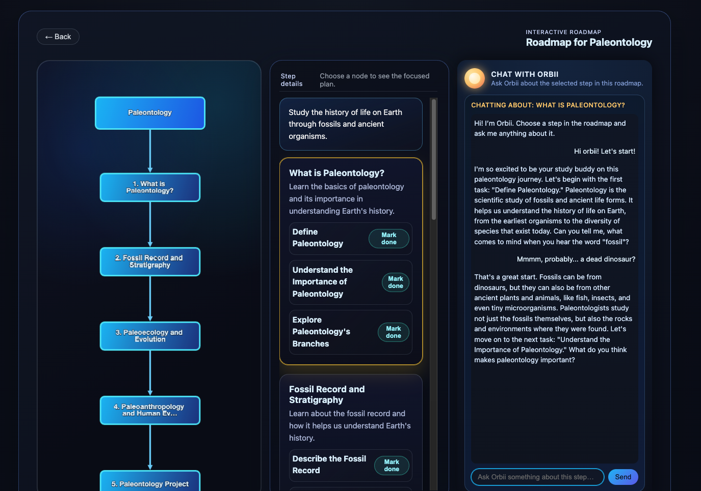

# Orbii – AI roadmap generator & study buddy on Cloudflare Workers AI

Orbii now centers on generating a topic roadmap and letting you chat with Orbii about each step. On the home screen you type a topic (“Minerals,” “binary search,” “Java basics…”) and click **Create the roadmap**. Workers AI produces a high-level, interactive roadmap with the major steps, subtopics, and a suggested order—meant as a “first pass” learning session so you know where to start and what comes next. On the right side of the roadmap screen you can chat with Orbii about the currently selected step in natural language. An experimental “Study with your files” mode still exists for uploading/pasting text and quizzing, but it is secondary and marked as “coming soon” from the home screen.

This repo is my optional submission for the Cloudflare Software Engineering Internship assignment. It aims to show a small but complete product that lives entirely on Cloudflare (Workers, Durable Objects, Workers AI) with clear prompt/state management documented for review.

## Live demo
- https://cf_ai_orbii.nico-esg-rey.workers.dev

- Hosted on Cloudflare’s Workers free plan with Workers AI, so the LLM calls may be rate-limited after heavy usage.

## How this meets the assignment requirements
- **LLM usage** – Workers AI’s `@cf/meta/llama-3.1-8b-instruct` generates the topic roadmap and answers chat questions about the selected roadmap step; in study mode it also answers/quiz prompts grounded in saved study text.
- **Workflow / coordination** – The `ChatSession` Durable Object stores session topic/study state and rolling history, assembles the persona + context + history message array documented in `PROMPTS.md`, and calls `env.AI.run` so each session stays coherent.
- **User input via chat** – The roadmap screen includes a chat sidebar tied to the selected node; the study screen keeps the classic chat for pasted/uploaded material and quiz prompts.
- **Memory / state** – Each Durable Object instance (keyed per browser tab) holds the current topic, roadmap context, study text, and recent chat so refreshes keep the same session.

## Architecture
1. **Browser UI** – `public/index.html`, `style.css`, and `app.js` render three screens: the home screen (topic input + roadmap/study buttons), the roadmap screen (graph canvas + step detail panel + chat with Orbii about the selected step), and the study screen (PDF/text upload, “Save to Orbii,” quiz button, and classic study chat).
2. **Cloudflare Worker (`src/worker.ts`)** – Serves static assets from `public/` and routes `/api/...` requests (chat, roadmap, study text, etc.) to the correct Durable Object instance based on `sessionId`.
3. **Durable Object (`src/chatSession.ts`)** – Manages per-session topic/study state, recent chat history, and message construction for Workers AI. Handles both roadmap generation and follow-up chat for roadmap steps or study text.
4. **Workers AI** – Runs `env.AI.run("@cf/meta/llama-3.1-8b-instruct", { messages })`, and the Durable Object persists the assistant response back into the session state.

## Tech stack
- Cloudflare Workers (TypeScript entry point in `src/worker.ts`).
- Durable Objects with SQLite-backed storage through the `new_sqlite_classes` migration.
- Workers AI using `@cf/meta/llama-3.1-8b-instruct`.
- Static frontend in vanilla HTML/CSS/JS with a `<canvas>`-based roadmap renderer.

## Features
- Topic roadmap generator: type a topic and get an interactive roadmap with major steps and subtopics, intended as a first-pass overview for a single learning session.
- Node-aware chat with Orbii: select a roadmap node and chat in the sidebar about that step (“what should I do here?”, “explain this more simply,” etc.).
- Study mode (experimental/legacy): upload a PDF or paste text, save it to the session, ask questions grounded in that material, and click “Quiz me on this” for one-question-at-a-time quizzes.
- Per-session memory via Durable Objects so each tab keeps the current topic/study text and recent conversation after refreshes.
- “Study with your files” stays marked “coming soon” on the home screen to signal roadmap-first focus.

## Running locally
1. `npm install`
2. `npm run dev` (runs `wrangler dev` with Miniflare at http://localhost:8787)
3. Open the home screen, create a roadmap for a topic, and chat with Orbii—or switch to the study screen to try the legacy flow.

`wrangler dev` connects to the bound Workers AI resource, so local testing still uses your Cloudflare account’s free Workers AI tier. Make sure the `AI` binding exists in your Cloudflare account before running the dev server.

## Deploying to Cloudflare
1. `npx wrangler login` to authenticate with your Cloudflare account.
2. Confirm `wrangler.toml` contains the `durable_objects` block for `ChatSession` and the `migrations` entry for `new_sqlite_classes` (already included in this repo).
3. `npm run deploy` (or `npx wrangler deploy`) to publish the Worker and Durable Object.
4. After deploy, Wrangler prints the workers.dev URL (already configured as `cf_ai_orbii.nico-esg-rey.workers.dev`), which matches the live demo link above.

## Limitations & future work
- Save/reopen multiple roadmaps per user and track progress or checklists per step.
- Better canvas layout, zooming, and panning for complex topics.
- Tighter roadmap/study-text links, e.g., associate steps with uploaded pages or excerpts.
- More robust PDF parsing and ingestion for study mode.
- Optional voice/realtime features and richer quiz modes once the roadmap-first MVP is solid.
